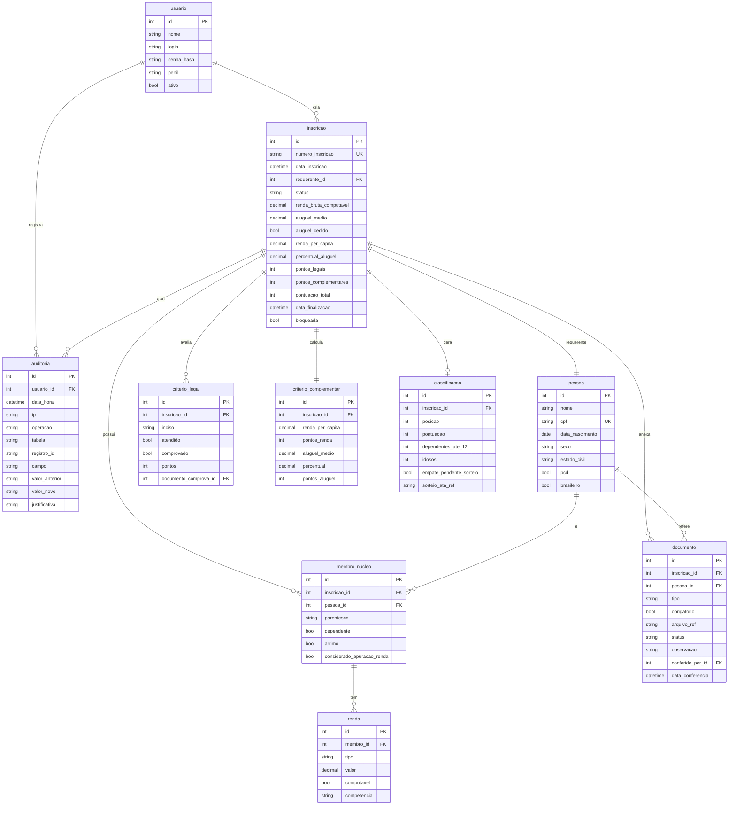

# 03 — Modelo de Dados

Modelo relacional inicial. Nomes em `snake_case`. Alvo: SQLite (dev) → PostgreSQL (prod).
Idades **nunca** são armazenadas — calcula-se a partir de `data_nascimento` na data de referência.

## Diagrama ER

## Notas de modelagem

- **`pessoa` é única por CPF** e reutilizável — permite detectar a mesma pessoa em núcleos
  diferentes (regra "uma inscrição por núcleo", itens 3.2/3.3.4). A checagem de duplicidade
  varre o CPF de **todos** os integrantes, não só o requerente.
- **`membro_nucleo`** liga `pessoa` a `inscricao` com o papel (`parentesco`) e as flags usadas
  na pontuação/desempate. `considerado_apuracao_renda` implementa a decisão D-2 (divisor da
  per capita).
- **`renda.computavel`** materializa as exclusões do item 3.1.4.1; a renda de enquadramento e
  a per capita somam apenas `computavel = true`.
- **`criterio_legal.documento_comprova_id`** e **`documento` por critério** dão a
  rastreabilidade exigida ("por que este candidato recebeu 170 pontos e qual documento
  comprova cada ponto").
- **Campos derivados na `inscricao`** (renda per capita, percentual, pontos) são **calculados
  pelo motor** e persistidos como *snapshot* no momento da finalização — mas sempre
  recomputáveis a partir dos dados-fonte e dos parâmetros.
- **`arquivo_ref`** guarda apenas a **referência**; o binário fica fora da raiz web
  (ver [05-seguranca-lgpd](05-seguranca-lgpd.md)).
- **`auditoria`** é *append-only*: sem update/delete; toda alteração pós-finalização passa por
  aqui com `justificativa`.
- **Grupos prioritários** (5% PcD / 5% idosos) derivam de `pessoa.pcd` e das idades — não
  precisam de tabela própria; entram como indicador na fase de encaminhamento.
